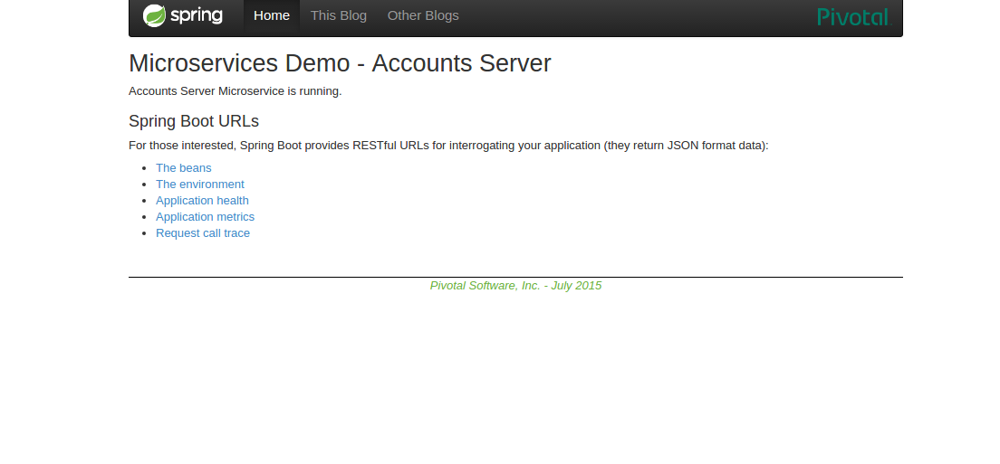
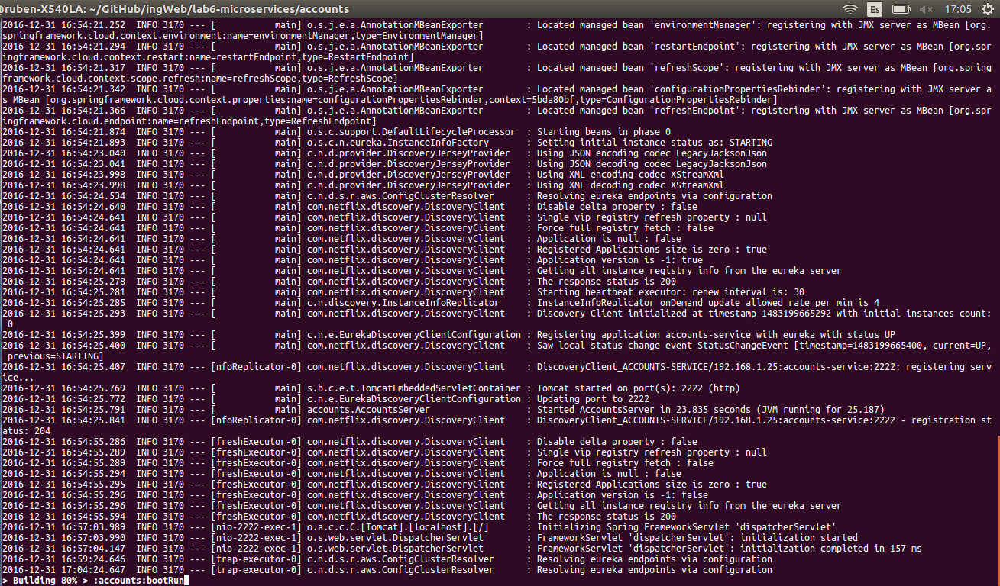
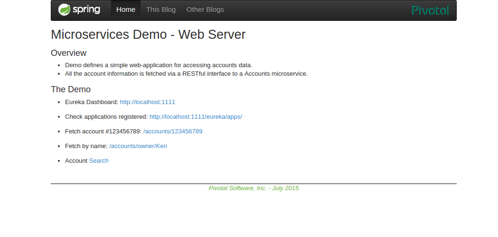
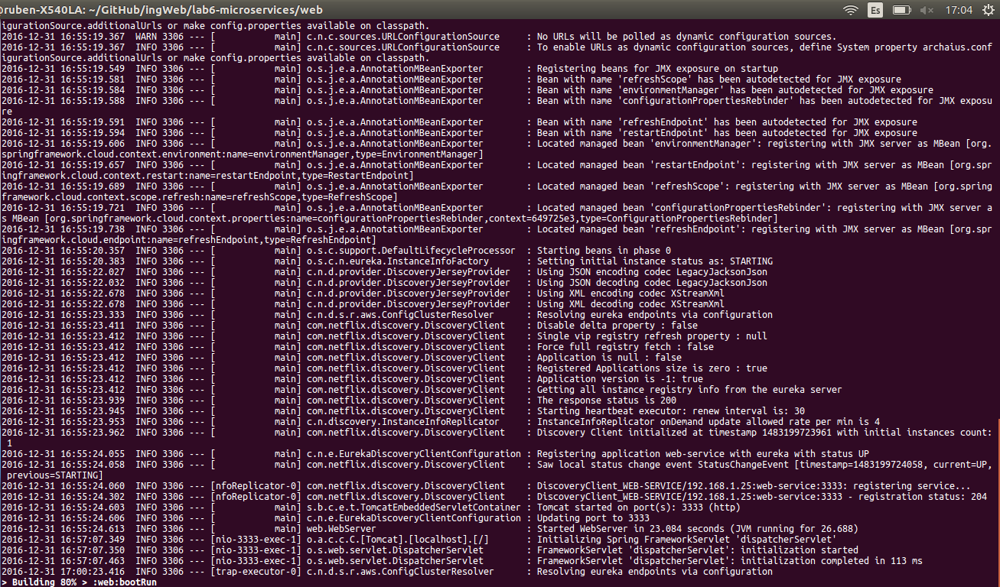
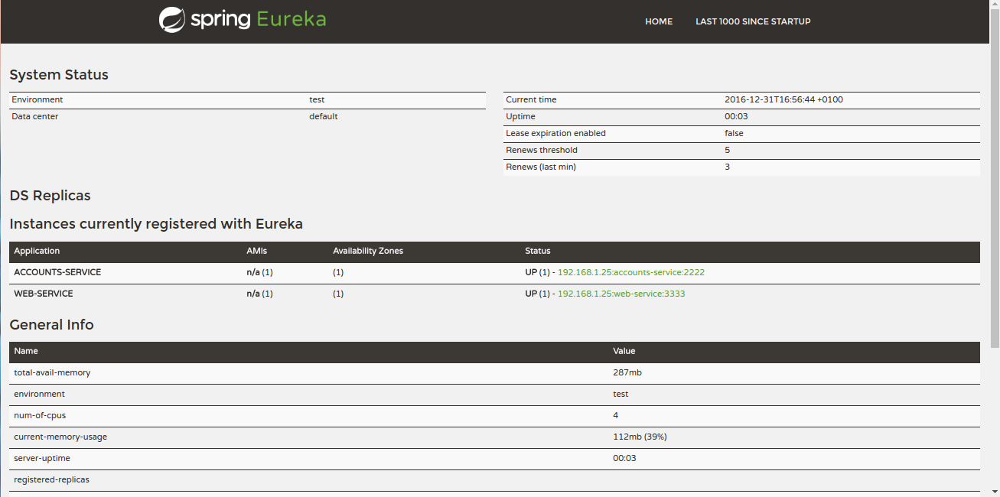
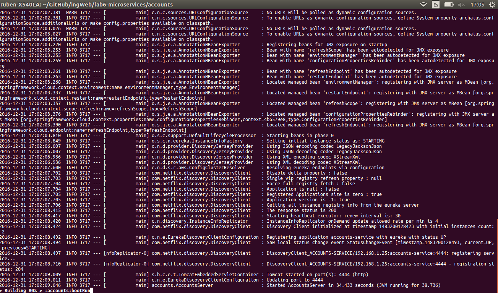
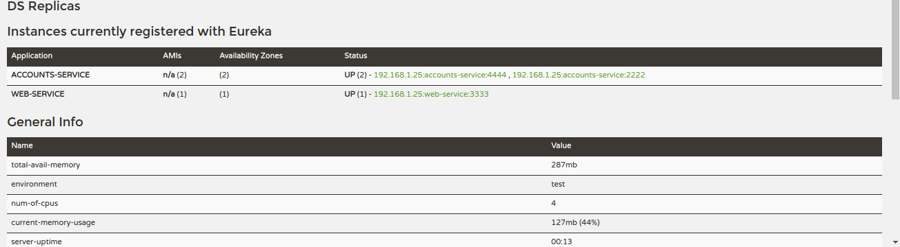

#**1. The two microservices are running and registered**
## Account Microservice

## WebService Microservice

#**2. The service registration service has the two microservices registered**

#**3. A second account microservice is running in the port 4444 and it is registered**

#**4. A brief report describing what happens when you kill the microservice with port 2222**
When you kill the Account Microservice with port 2222, the WebService Microservice on port 3333 tries to communicate with the killed one. Then it received a "Refused Connection" because of the Account MicroService on port 2222 has been killed. Next, it communicates with the Registration Service on port 1111 to request a microservice that provides the Account service. It receives a response to reports that the new Account Microservice is on port 4444, and finally it starts working again.