#**Lab Microservices - Web Engineering 2016-2017**

##**Setup**
### Server Eureka is launched
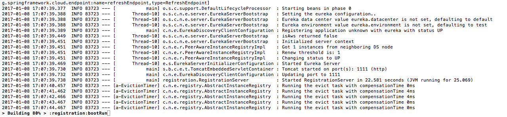

##**The two Microservices are running in the port 2222, 3333 and registered**
### Services Registration
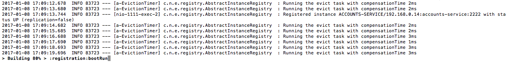
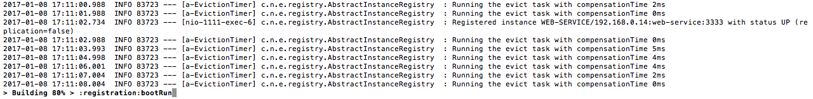

### Account Microservice
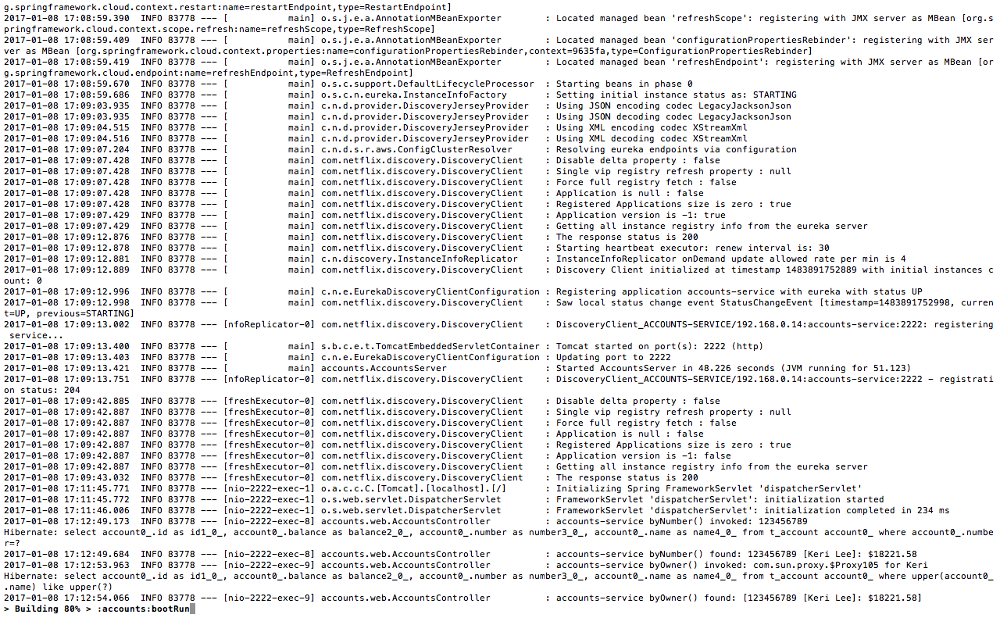
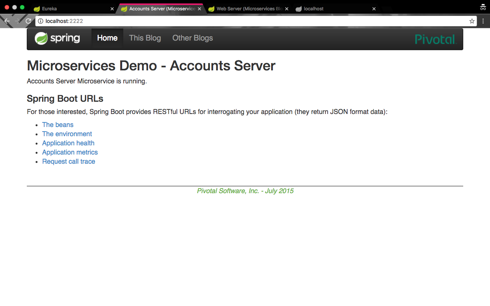

### WebService Microservice
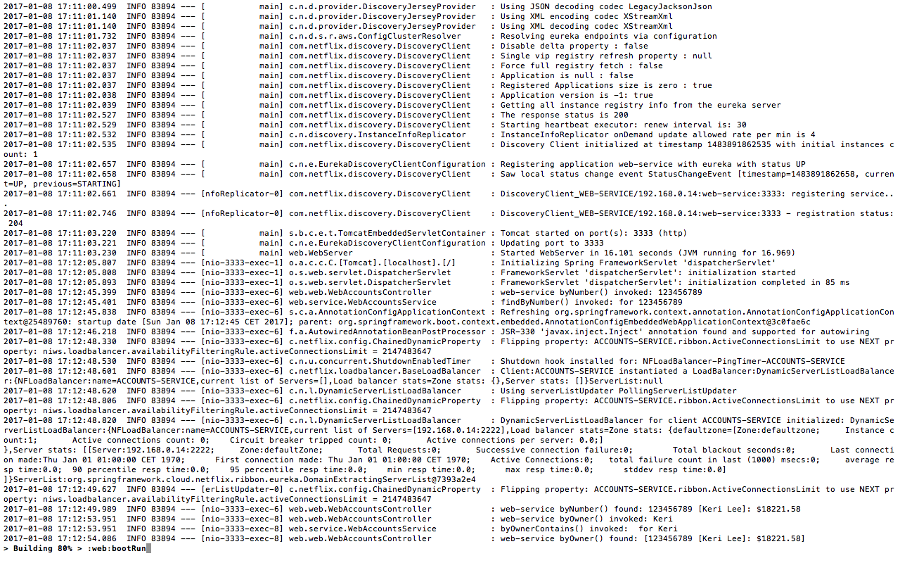
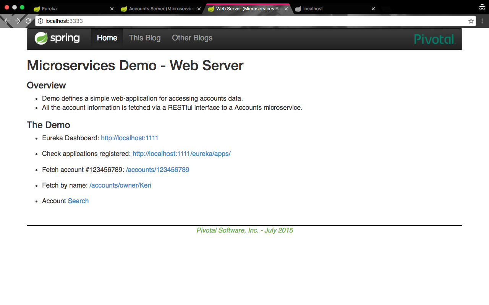

##**The service Registration Service Eureka has the two Microservices registered**
### Server Eureka
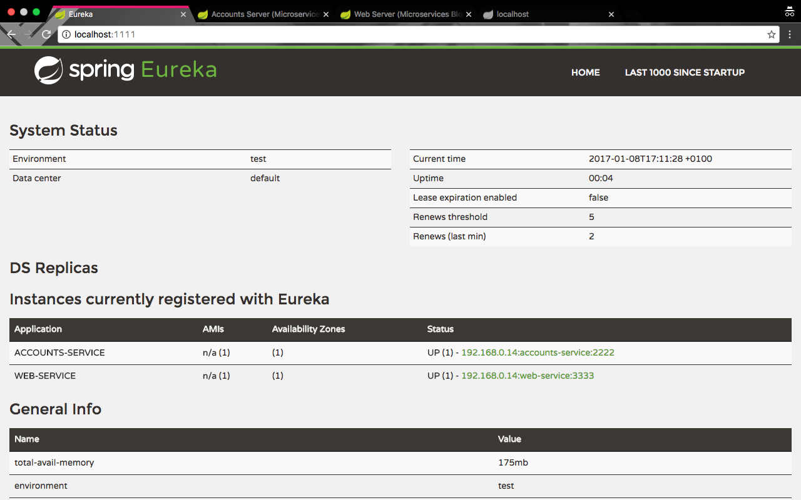

##**Second Account Microservice is running in the port 4444 and it is registered**
### Service Registration
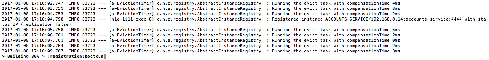

### Second Account Microservice
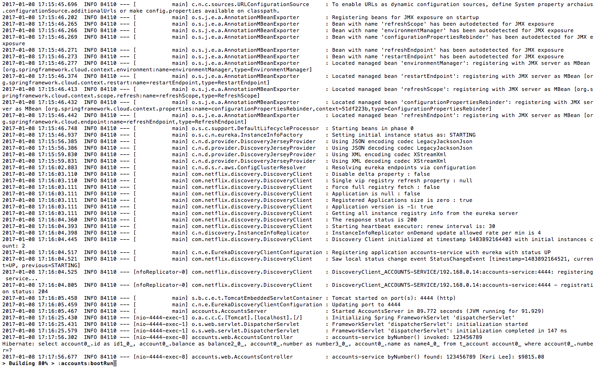
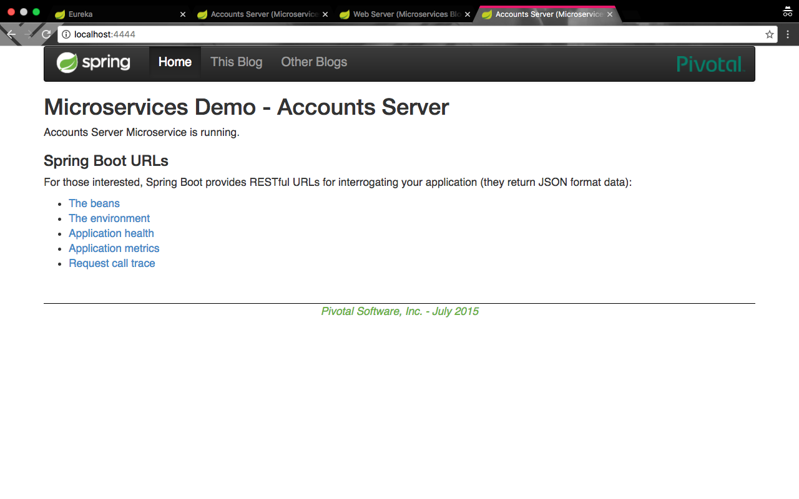

### Server Eureka
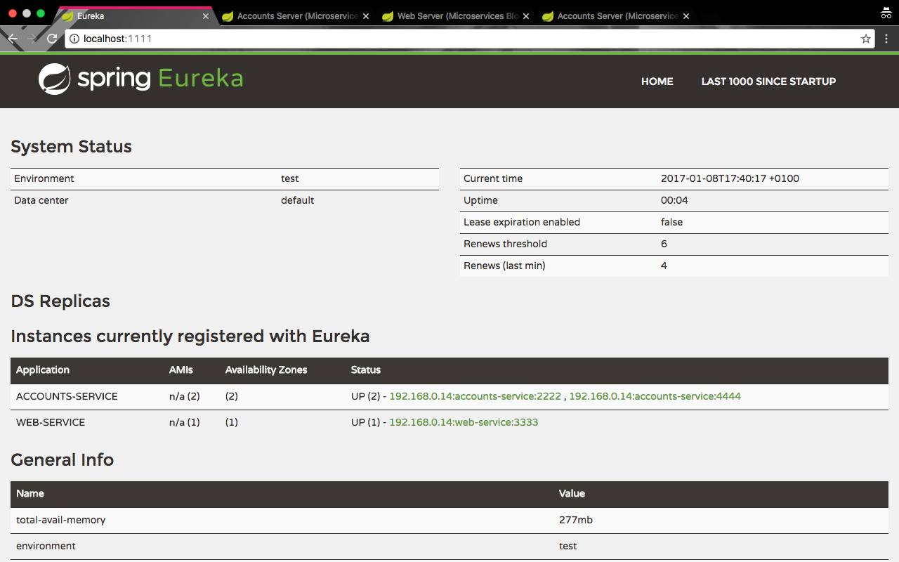

##**Brief report and kill the Account Microservice with port 2222**
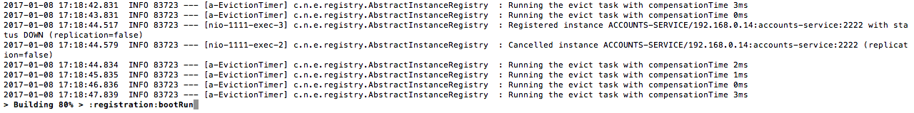

When someone add or kill a Microservices the WebService Microservice on port 3333 comunicates with the Registration Service on port 1111 and configure the endpoint with the Account Microservice endpoint most recently. In this way the WebService Microservice can continue to consume data from a Account Microservice even when it changes location.
